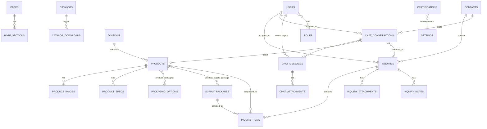

# 03 — Database Design (ERD)

**Database:** MySQL 8.4 LTS or 9.7 LTS · **Charset:** utf8mb4 · **Engine:** InnoDB · **Conventions:** snake_case, `id` BIGINT unsigned, `created_at/updated_at`, soft deletes where noted.
**Translations:** translatable text stored as JSON per locale (`{"en": "...", "ar": "..."}`), for example using `spatie/laravel-translatable`.

## 1. Entity Relationship Diagram

## 2. Table Dictionary

### 2.1 Access and staff
| Table | Key columns | Notes |
|-------|-------------|-------|
| `users` | id, name, email (unique), password, avatar, phone, is_active, is_online, last_seen_at, two_factor_* , remember_token | Staff only |
| `roles`, `permissions`, `model_has_roles`, … | from `spatie/laravel-permission` | Roles: super_admin, sales, content_manager, chat_agent |

### 2.2 Catalog
| Table | Key columns | Notes |
|-------|-------------|-------|
| `divisions` | id, slug (unique), name (json), summary (json), description (json), cover_image, icon, sort_order, is_active, seo_title (json), seo_description (json) | Rice, Wheat, Grains, Dry Fruits, Leather, Textile & Garments |
| `products` | id, division_id FK, slug (unique), name (json), short_description (json), description (json), origin, moq_value, moq_unit, lead_time_days, is_featured, is_active, sort_order, seo_* , deleted_at | Index: division_id, is_active, is_featured |
| `product_images` | id, product_id FK, path, alt (json), is_primary, sort_order | |
| `product_specs` | id, product_id FK, spec_key (json), spec_value (json), sort_order | Flexible: moisture, grain length, GSM, size range… |
| `packaging_options` | id, name (json), kind (bag, carton, jar, pallet, bulk, container, custom), size_value, size_unit, notes (json), is_active | e.g. 1 kg, 5 kg, 25 kg, 50 kg, 1 MT jumbo bag, 20ft/40ft container |
| `product_packaging` | product_id, packaging_option_id | Pivot |
| `supply_packages` | id, slug, name (json), audience (json), description (json), min_qty_note (json), icon, sort_order, is_active | Sample, Retail, Wholesale, Bulk/Container, Private Label, Contract |
| `product_supply_package` | product_id, supply_package_id | Pivot |

### 2.3 Leads
| Table | Key columns | Notes |
|-------|-------------|-------|
| `contacts` | id, name, email, phone, whatsapp, company, designation, country_code, city, first_seen_at, last_seen_at, source, marketing_opt_in | One person across RFQs and chats; unique on email where present |
| `inquiries` | id, reference (unique, e.g. VEL-2026-00001), contact_id FK, status (new, contacted, quoted, negotiating, won, lost, spam), priority, destination_port, delivery_timeline, message, locale, ip_address, user_agent, utm_*, assigned_to FK users, quoted_at, closed_at, deleted_at | Indexes: status, assigned_to, created_at |
| `inquiry_items` | id, inquiry_id FK, product_id FK null, product_name_text, quantity, unit, supply_package_id FK null, packaging_option_id FK null, notes | Multi-product RFQ |
| `inquiry_attachments` | id, inquiry_id FK, disk, path, original_name, mime, size | |
| `inquiry_notes` | id, inquiry_id FK, user_id FK, body, created_at | Internal |
| `contact_messages` | id, name, email, phone, subject, message, status, ip_address | Simple contact form |
| `newsletter_subscribers` | id, email (unique), confirmed_at, unsubscribed_at | |

### 2.4 Live chat
| Table | Key columns | Notes |
|-------|-------------|-------|
| `chat_conversations` | id, uuid (public id), contact_id FK, visitor_token (hashed), status (waiting, active, closed, offline), assigned_to FK users null, product_id FK null, inquiry_id FK null, page_url, locale, country_code, ip_address, user_agent, rating, rating_comment, started_at, first_response_at, last_message_at, closed_at, unread_agent_count, unread_visitor_count | Indexes: status, assigned_to, last_message_at |
| `chat_messages` | id, conversation_id FK, sender_type (visitor, agent, system, bot), sender_id null, body (text), type (text, file, note), is_internal, read_at, delivered_at, created_at | Index: conversation_id + id |
| `chat_attachments` | id, message_id FK, disk, path, original_name, mime, size | Max size and types in settings |
| `chat_canned_replies` | id, title, shortcut, body (json), is_active | e.g. `/greeting`, `/moq` |
| `chat_business_hours` | id, weekday, opens_at, closes_at, is_closed | Plus timezone in settings |
| `chat_blocked_visitors` | id, ip_address, contact_id null, reason | Abuse control |

### 2.5 Content
| Table | Key columns |
|-------|-------------|
| `pages` | id, slug, title (json), template, is_active, seo_* |
| `page_sections` | id, page_id FK, type (hero, text, stats, cards, faq, cta…), content (json), sort_order, is_active |
| `hero_slides` | id, title (json), subtitle (json), media_path, media_type, cta_label (json), cta_url, sort_order, is_active |
| `faqs` | id, scope (global, division, product), scope_id, question (json), answer (json), sort_order |
| `posts` | id, slug, title (json), excerpt (json), body (json), cover_image, published_at, is_active, seo_* |
| `gallery_items` | id, title (json), path, type, sort_order |
| `export_markets` | id, country_code, name (json), lat, lng, is_active |
| `catalogs` | id, title (json), division_id null, file_path, requires_email, is_active |
| `catalog_downloads` | id, catalog_id FK, contact_id null, email null, ip_address, created_at |
| `certifications` | id, name (json), issuer, file_path, logo_path, is_visible (default false), sort_order | **Hidden by default**; also gated by global setting |
| `team_members` | id, name, position (json), photo, sort_order, is_active |

### 2.6 System
| Table | Key columns |
|-------|-------------|
| `settings` | key (unique), value (json), group |
| `languages` | code, name, direction (ltr/rtl), is_default, is_active |
| `activity_log` | from `spatie/laravel-activitylog` |
| `media` | from `spatie/laravel-medialibrary` (optional) |
| `jobs`, `failed_jobs`, `cache`, `sessions`, `notifications` | Laravel standard |

## 3. Indexing and Integrity Notes
- Foreign keys with `ON DELETE RESTRICT` for catalog, `CASCADE` for children (images, specs, messages).
- Full-text index on `products` (name, short_description) or Laravel Scout (Meilisearch) later.
- Private files (RFQ attachments, chat files) stored on a **non-public disk** and served through authorised routes or signed URLs.
- Personal data (contacts, chats) subject to retention policy (e.g. purge chats older than 24 months on request).
