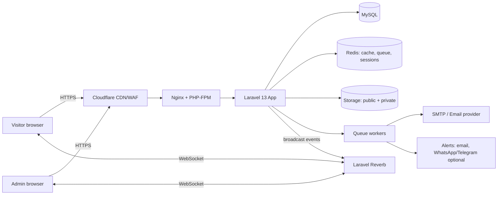

# 04 — System Architecture

## 1. Architecture Choice
A **modular monolith** in Laravel 13: one codebase, clear modules, server-rendered public pages (best for SEO), Filament admin, and a realtime layer for chat. Simple to host, secure, easy to extend.

## 2. Tech Stack

| Layer | Choice | Reason |
|-------|--------|--------|
| Language | PHP 8.3 or 8.4 (Laravel 13 supports 8.3–8.5) | Current, supported |
| Framework | Laravel 13.x | Current major; Laravel 11 is out of security support |
| Database | MySQL 8.4 LTS (shared/cPanel) or 9.7 LTS (own VPS) | Long-term support; avoid the short-life innovation track for production |
| Frontend | Blade + Tailwind CSS + Vite | Fast, SEO-friendly |
| Interactivity | Alpine.js 3.x (version pinned), Livewire 3/4 for chat UI and forms | Light, no SPA needed |
| Scroll animation | Alpine `x-intersect` + Tailwind transitions (or AOS 2.3.4 if preferred) | Fewer dependencies |
| Admin | Filament (confirm Laravel 13 compatible release at setup) | Fast CRUD, roles, widgets |
| Realtime | **Laravel Reverb** (WebSocket) + Laravel Echo | First-party, self-hosted |
| Queue / cache | Redis (or database driver on small hosts) | Email, notifications, caching |
| Search | MySQL full-text now; Scout + Meilisearch later | Scalable path |
| Files | Local private/public disks; S3-compatible later | |
| Email | SMTP / Mailgun / Amazon SES | Deliverability |
| Security helpers | Cloudflare Turnstile, spatie/laravel-permission, 2FA | |
| Monitoring | Laravel logs, Sentry (optional), uptime monitor | |

> Rule: pin exact versions in lock files; never use "latest" CDN links. Verify package compatibility (Filament, Reverb, Livewire) against Laravel 13 at kick-off.

## 3. High-Level Diagram



## 4. Module Structure

```
app/
├── Models/                 (Division, Product, Inquiry, ChatConversation …)
├── Http/Controllers/Web/   (Home, Division, Product, Rfq, Contact, Page)
├── Http/Controllers/Chat/  (Visitor chat endpoints)
├── Livewire/               (RfqForm, ChatWidget, ProductFilter)
├── Filament/Resources/     (Division, Product, Inquiry, Package, Page, Catalog …)
├── Filament/Pages/         (ChatInbox, Settings, Dashboard)
├── Events/                 (MessageSent, ConversationStarted, ConversationAssigned)
├── Notifications/          (NewInquiry, NewChat, ChatOfflineMessage)
├── Services/               (InquiryService, ChatService, CatalogService)
├── Policies/
resources/views/            (layouts, pages, components)
routes/web.php, channels.php, api.php
```

## 5. Key Flows

**RFQ:** form → validation + Turnstile → save contact + inquiry + items (+ attachments to private disk) → queue: email to sales, auto-reply to buyer → admin notification → status workflow in Filament.

**Chat:** visitor opens widget → creates conversation (token cookie) → message saved → `MessageSent` broadcast on private channel → agent inbox updates instantly → reply broadcast back. Details in doc 06.

**Content:** admin edits → cache cleared (tagged) → sitemap regenerated.

## 6. Multi-Language
Locale in URL prefix (`/en`, `/ar`), JSON translatable fields, language switcher, RTL stylesheet (Tailwind logical properties), `hreflang` tags. Launch: English (+ Arabic if client confirms). Others added via Languages table.

## 7. Security

| Area | Measures |
|------|----------|
| Transport | HTTPS only, HSTS, Cloudflare WAF |
| Auth | Strong passwords, 2FA for admins, login throttling, separate `/admin` route |
| Input | Form requests validation, CSRF, output escaping, strict upload rules (type, size, rename, no execution) |
| Chat | Rate limit messages, profanity/spam filter, block list, visitor token is random and hashed, private channels authorised per conversation |
| Data | Private disk for attachments, signed URLs, encrypted backups |
| Headers | CSP, X-Frame-Options, Referrer-Policy, Permissions-Policy |
| Ops | `.env` outside web root, debug off, regular `composer audit`, dependency updates |
| Privacy | Cookie consent, privacy policy, retention and deletion on request |

## 8. Performance
Route/config/view caching, OPcache, Redis cache, image conversion to WebP/AVIF with responsive sizes, lazy loading, minified/hashed assets, HTTP/2, Cloudflare caching for static files, eager loading to avoid N+1, DB indexes.

## 9. Hosting and Environments

| Option | Verdict |
|--------|---------|
| **VPS (2 vCPU / 4 GB RAM minimum)** + Nginx, PHP-FPM, MySQL, Redis, Supervisor | **Recommended** — needed for Reverb and queue workers |
| Good cPanel host (PHP 8.3+) | Works for site + admin; chat falls back to short polling (3–5 s) and queue via cron |

Environments: **local → staging → production**. Git repository, CI to run tests, zero-downtime deploys (Envoyer, Deployer or GitHub Actions + SSH). Supervisor keeps `queue:work` and `reverb:start` running. Daily DB backups (7 daily, 4 weekly, 6 monthly), off-server copy.

## 10. Testing Strategy
Pest/PHPUnit feature tests (RFQ, chat, permissions), browser tests for key journeys (Laravel Dusk/Playwright), Lighthouse budget, security scan, load test of chat with simulated 100 concurrent visitors.

## 11. Scalability Path
Move DB to managed MySQL, add Redis/Reverb scaling, S3 + CDN for media, Meilisearch, buyer portal (authentication already available), REST API for future mobile app.
