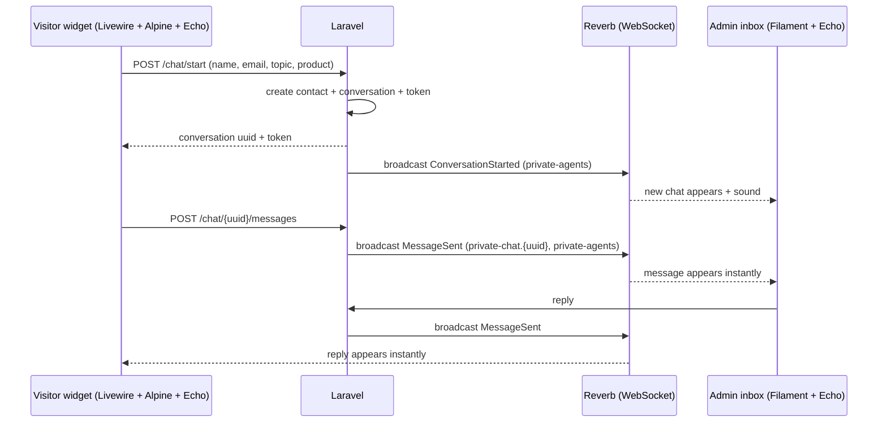

# 06 — Live Chat System (Visitor ↔ Admin)

## 1. Purpose
Let any website visitor talk directly with Velmora's team. Every message goes to the **admin panel chat inbox** in real time, built natively in Laravel (no third-party chat SaaS, so data stays with the company).

## 2. Experience Overview

**Visitor side**
1. Floating chat button (bottom corner) with a small welcome teaser after a few seconds.
2. Pre-chat form: name, email (required), phone/WhatsApp (optional), topic (Product enquiry, Pricing, Samples, Private label, Other). If opened from a product page, the product is attached automatically.
3. Chat window: messages, typing indicator, delivered/read ticks, file attach (images, PDF), emoji, timestamps, "Online / We reply within X minutes".
4. History kept on the same device (token cookie); returning visitors continue the same conversation.
5. Outside business hours or if no agent online: "Leave a message" mode; reply by email/WhatsApp, and message still appears in the inbox flagged **Offline**.
6. End: optional rating, and "Email me this transcript".
7. Shortcut buttons: Request a Quote, WhatsApp, Download Catalog.

**Admin side (Filament page "Chat Inbox")**
- Left: conversation list with filters (Waiting, Mine, All, Closed, Offline), unread badge, search by name/email/country/product.
- Centre: message thread, internal notes (not visible to visitor), canned replies via `/shortcut`, file send, typing indicator.
- Right: visitor details (contact, country, page URL, product, previous RFQs/chats), buttons: **Assign to me / Transfer**, **Convert to RFQ**, **Close**, **Block**.
- Notifications: sound, tab-title counter, browser notification, email for offline messages, optional Telegram/WhatsApp alert to the owner.
- Agent status toggle: Online / Away.

## 3. Technical Design

**Channels**
- `private-chat.{uuid}` — visitor and assigned agent. Authorisation: visitor token matches hashed token; agents need `chat_agent` permission.
- `private-agents` — all online agents (new conversations, unread counters).
- `presence-agents` — who is online (drives the "Online" indicator).

**Events:** `ConversationStarted`, `MessageSent`, `MessageRead`, `AgentTyping`, `VisitorTyping`, `ConversationAssigned`, `ConversationClosed`.

**Endpoints (public, throttled)**
| Method | Path | Purpose |
|--------|------|---------|
| POST | `/chat/start` | Create conversation |
| GET | `/chat/{uuid}/messages` | Load history (token required) |
| POST | `/chat/{uuid}/messages` | Send message |
| POST | `/chat/{uuid}/attachments` | Upload file |
| POST | `/chat/{uuid}/read` | Mark read |
| POST | `/chat/{uuid}/rating` | Rating |
| POST | `/chat/offline` | Offline message |

**Fallback for shared hosting:** if WebSocket is unavailable, the widget polls every 3–5 seconds (`GET /chat/{uuid}/messages?after=ID`), and the admin inbox uses Livewire polling. Same data model, no code change in business logic.

## 4. Business Rules

- Business hours and time zone are set in admin (default Pakistan Standard Time). Outside hours, show offline mode and an expected reply time.
- Auto-assignment: round-robin among online agents, or unassigned until someone claims it.
- If no agent replies within N minutes (default 3), send an automatic message offering WhatsApp/email/RFQ and email an alert to the owner.
- Conversations auto-close after 24 hours of inactivity (configurable); transcripts retained per policy.
- Convert to RFQ: copies contact and product context into a new inquiry and links both records.
- Internal notes never broadcast to the visitor channel.
- Max message length 2,000 chars; attachments: jpg/png/webp/pdf/docx/xlsx, max 10 MB, stored privately and virus-scan hook optional.

## 5. Anti-Abuse and Privacy
Rate limit (e.g. 20 messages/min per conversation), Turnstile on first message, honeypot, IP/contact block list, link filtering for new visitors, HTML escaping everywhere. Chat notice: "By chatting you agree to our Privacy Policy." Visitor can request transcript deletion. Retention default: 24 months.

## 6. Admin Settings for Chat
Enable/disable widget, welcome text and teaser (translatable), business hours, auto-reply texts, response SLA, canned replies, sound on/off, allowed pages (exclude e.g. legal pages), widget colour (uses brand tokens), notification emails, WhatsApp number fallback.

## 7. Reports
Chats per day/week, average first-response time, average duration, rating, chats by country/product, conversion to RFQ, missed chats (offline/unanswered).

## 8. Acceptance Criteria
1. A visitor message appears in the admin inbox within 2 seconds (WebSocket mode).
2. Agent reply appears in the visitor window within 2 seconds.
3. Page reload restores the conversation on the same device.
4. Offline message creates a flagged conversation and sends an email alert.
5. Unauthorised users cannot read any conversation they do not own.
6. Works on mobile (no overlap with WhatsApp button) and with RTL (Arabic).
7. 100 simultaneous open chats without errors in load test.

## 9. Future Options
AI/FAQ auto-answer for common product questions, WhatsApp Business API bridge, visitor translation (Arabic/Chinese ↔ English), buyer accounts with chat history.
